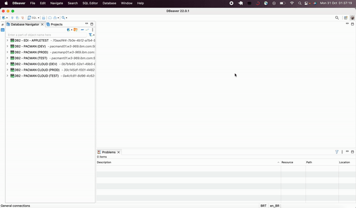
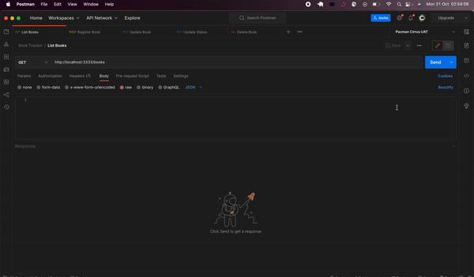

<h1 align="center">
    
</h1>

<p align="center">
   
</p>
<p align="center">
  <a href="#bookmark-sobre">Sobre</a>&nbsp;&nbsp;&nbsp;|&nbsp;&nbsp;&nbsp;
  <a href="#rocket-tecnologias">Tecnologias</a>&nbsp;&nbsp;&nbsp;|&nbsp;&nbsp;&nbsp;
  <a href="#%EF%B8%8F-configuração">Configuração do projeto</a>&nbsp;&nbsp;&nbsp;|&nbsp;&nbsp;&nbsp;
  <a href="#man_factory_worker-testando-os-requisitos">Testando os requisitos</a>&nbsp;&nbsp;&nbsp;|&nbsp;&nbsp;&nbsp;
  <a href="#pushpin-to-do">To-do</a>&nbsp;&nbsp;&nbsp;
</p>

<p align="center">
  
<p>

## :bookmark: Sobre

O **Book Tracker** é uma plataforma de leitura de livros online, que permite acompanhar o progresso das suas leituras. Você pode adicionar, editar e visualizar sua lista de livros cadastrados, além de poder avaliar os livros já lidos informando uma nota de zero a dez.

## :rocket: Tecnologias

- [TypeScript](https://www.typescriptlang.org/)
- [React](https://reactjs.org/)
- [Nodejs](https://nodejs.org/en/)
- [Typeorm](https://typeorm.io/)
- [PostgreSQL](https://www.postgresql.org/)


## ⚙️ Configuração

- ### **Pré-requisitos**

  - É **necessário** possuir o db PostgreSQL instalado na máquina. Para Mac, clique **[aqui](https://postgresapp.com/downloads.html)** para fazer o download (Postgres.app with PostgreSQL 15 (Universal)
  - Após instalar, abrir o PostgreSQL 15 e rodar o banco de dados local clicando em **start**
  - Abra seu o seu gerenciador de banco de dados preferido e inicie uma nova conexão localhost 

  <br/>
  <p align="center">
    <span>Exemplo com Dbeaver</span>
  </p>
  <p align="center">
    
  <p>
    
- ### Executando o backend

  ```bash
  # Se ainda não tiver clonado o projeto, abra um terminal e copie este repositório com o comando
  $ git clone https://github.com/alexandrecorazza/book-tracker.git

  # Entre na pasta server 
  $ cd book-tracker/server/

  # Instale as dependências
  $ npm install

  # Para rodar a migration e criar a tabela necessária no seu banco de dados local
  $ npm run migration-run

  # Caso queira desfazer a criação da tabela anterior
  $ npm run migration-revert

  # Rode o server
  $ npm run dev
  ```

<br>

- ### Executando o frontend

  ```bash
  # Entre na pasta web 
  $ cd book-tracker/web/

  # Instale as dependências
  $ npm install
    
  # Rode o app
  $ npm run dev
  ```

<br>

## :man_factory_worker: Testando os requisitos
Os requisitos podem ser testados via **Postman** de acordo com as seguintes rotas:
- Listar livros cadastrados: **GET** - http://localhost:3333/books
- Deleta livro: **DELETE** - http://localhost:3333/books/{id}
- Adicionar novo livro: **POST** - http://localhost:3333/books
```
#Exemplo

#Incluir no body
{
    "title": "The Da Vinci Code",
    "author": "Dan Brown"
}
```
- Editar livro pelo id: **PUT** - http://localhost:3333/books/{id}
```
#Exemplo

#URL
http://localhost:3333/books/1

#Incluir no body
{
    "title": "Alice Wonderland",
    "author": "Lewis Carroll"
}
```
- Edita status e dar nota ao livro, desde que o status seja "Lido": **PUT** - http://localhost:3333/books/status/{id}
```
#Exemplo

#URL
http://localhost:3333/books/status/1

#Incluir no body
{
    "rate": "10",
    "status": "Lido"
}
```

<p align="center">
    
<p>

## :pushpin: To-Do

- [X] Adicionar novos livro
- [X] Listar livros cadastrados
- [X] Editar livro
- [X] Atribuir nota
- [X] Excluir livro
- [ ] Finalizar construção da *landing page*
- [ ] Autenticação de usuário
